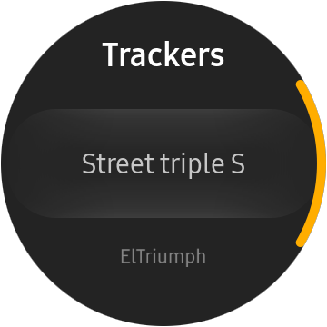

# GeoRideTizenWearable

### Description

EN

This application is an adaptation of the GeoRide mobile application (bike tracker) (https://georide.fr/) to make it compatible with Samsung watches (Tizen OS). It is not an official application developed by GeoRide but an application developed in OpenSource using the API made available to the community.

The current features are: 

* Lock a tracker
* Unlock a tracker
* Select a tracker

FR

Cette application est une adaptation de l'application mobile GeoRide (tracker moto) pour la rendre compatible avec les montres Samsung (Tizen OS). Il ne s'agit pas d'une application officielle développée par GeoRide mais d'une application développée en OpenSource à l'aide de l'api mise à disposition de la communauté. 

Les fonctionnalités actuelles sont : 

* Verrouiller un tracker
* Déverrouiller un tracker
* Sélectionner un tracker

### Screenshots

### Features

* Lock a tracker
* Unlock a tracker
* Select a tracker

### Prerequisites

* [Visual Studio](https://www.visualstudio.com/) - Buildtool, IDE
* [Visual Studio Tools for Tizen](https://developer.tizen.org/development/visual-studio-tools-tizen/installing-visual-studio-tools-tizen) - Visual Studio plugin for Tizen .NET application development

### Author
* Elvis COUTRET
